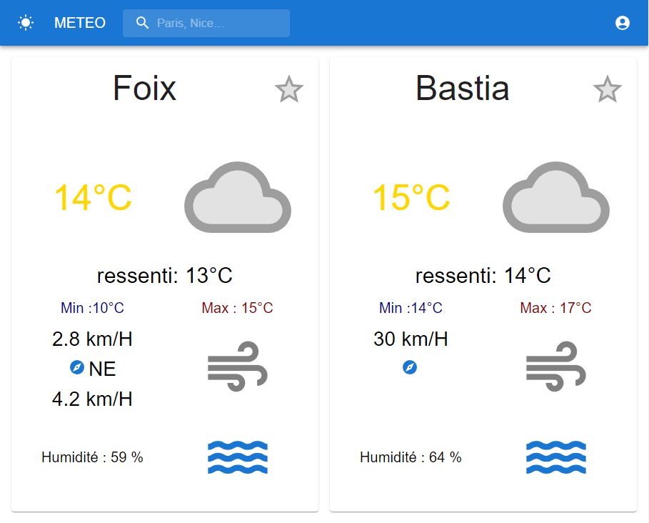
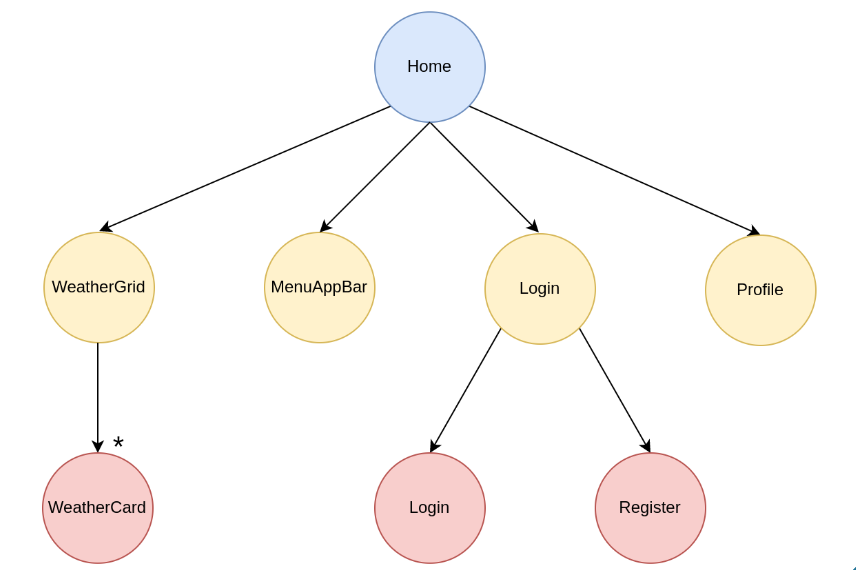
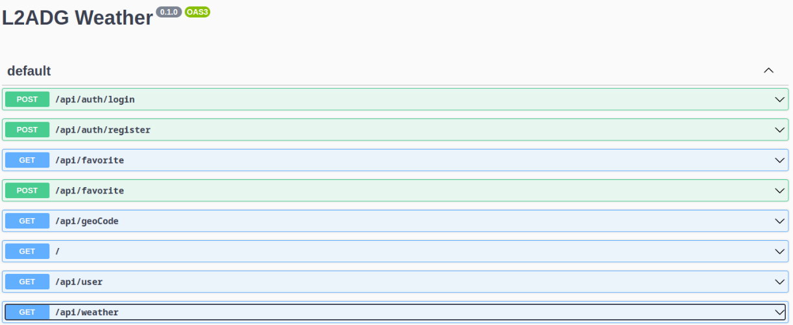
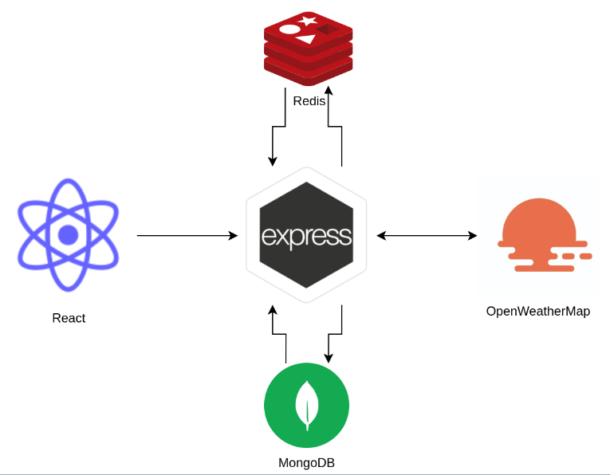

# WeatherCard

## Objective 

create a React and Express application to display the weather.

This application must have user management.

## Project

### Front



-----
#### schema of component : 



-----

### API


### Architecture du project



### Data Model

```js
[
    {
        username: 'Alexis',
        email: 'alexis@devleeschauwer.fr',
        favorites: [
            'Foix',
            'Bastia'
        ],
        hashedPassword: '$2b$10$Uz4Dy3SRzlA3nLp6qgyK8e...',
    }
]
```

### Redis


## Deploying 


```bash
docker-compose up -d
```


